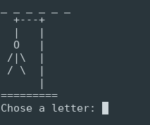

# Hangman Game
Practicing Python creating a basic game, the hangman game.

We have to guess letter by letter of one word.
If you guess the word, you'll win the game.
If your attempts are over, you will lose.

# Dependencies

## random
In this game, I use random to get random word in the DB.

## OS
I used os to clear the terminal, when the user try, win or lose.

# Install
Clone this repository in a folder, then you can try the game :)

# Execute
With the following command in your terminal, we'll start the game:

    python3 game.py

